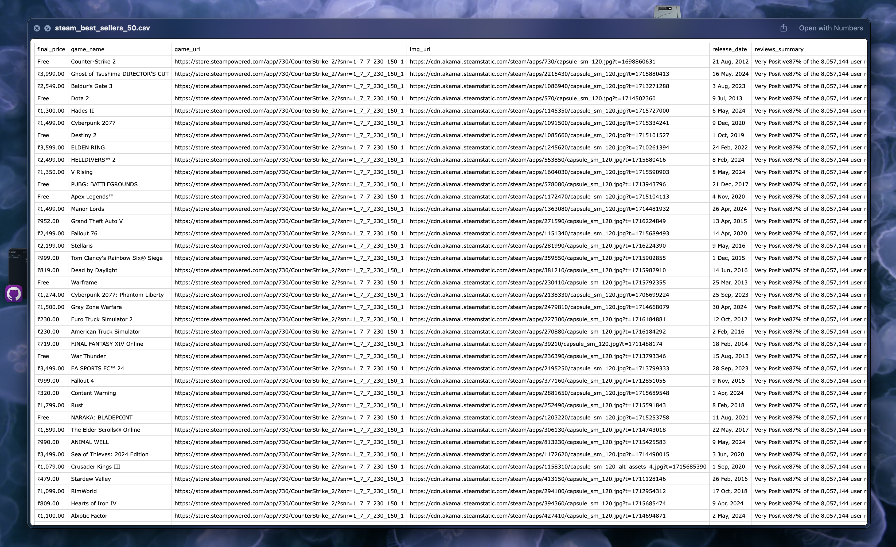

# Web Scraping Project

This project demonstrates web scraping using Scrapy to extract data from multiple websites, including the Steam gaming platform and Inshorts news site. The extracted data is then processed and saved in various formats, including CSV and PDF.

## Project Description

The project consists of two main parts:
1. **Steam Scraper**: Scrapes top-selling game data from the Steam platform.
2. **Inshorts Scraper**: Scrapes news articles from Inshorts.

### Steam Scraper
- Extracts data such as game name, game URL, image URL, release date, price, and review summary.
- Saves the extracted data into a CSV file.
- Converts the CSV data into a formatted PDF.

### Inshorts Scraper
- Extracts news articles including titles, content, author, and timestamp.
- Saves the extracted data into a CSV file.

## Setup Instructions

1. **Clone the Repository**
    ```bash
    git clone https://github.com/yourusername/web-scraping-project.git
    cd web-scraping-project
    ```

2. **Create and Activate a Virtual Environment**
    ```bash
    # On macOS and Linux
    python3 -m venv venv
    source venv/bin/activate

    # On Windows
    python -m venv venv
    venv\Scripts\activate
    ```

3. **Install Required Packages**
    ```bash
    pip install -r requirements.txt
    ```

4. **Configure Scrapy Settings**
    - Ensure you have the correct settings in `settings.py` for each Scrapy spider.

## Usage

### Running the Steam Scraper
1. **Navigate to the Steam Scraper Directory**
    ```bash
    cd steam_scraper
    ```

2. **Run the Scraper**
    ```bash
    scrapy crawl infinite_scroll -o steam_best_sellers.csv
    ```

3. **Convert CSV to PDF**
    ```bash
    python csv_to_pdf.py
    ```

### Running the Inshorts Scraper
1. **Navigate to the Inshorts Scraper Directory**
    ```bash
    cd inshorts_scraper
    ```

2. **Run the Scraper**
    ```bash
    scrapy crawl inshorts -o inshorts_news.csv
    ```

## File Structure
Please clone this repo and run this command in terminal `tree` to understand the directory structure 

## Demo 

## Contribution Guidelines

1. **Fork the Repository**
2. **Create a New Branch**
    ```bash
    git checkout -b feature-branch
    ```
3. **Make Changes and Commit**
    ```bash
    git commit -m "Description of changes"
    ```
4. **Push to Your Fork**
    ```bash
    git push origin feature-branch
    ```
5. **Create a Pull Request**


## Contact

For any questions or suggestions, feel free to contact me at [maniksinghsarmaal@gmail.com].

